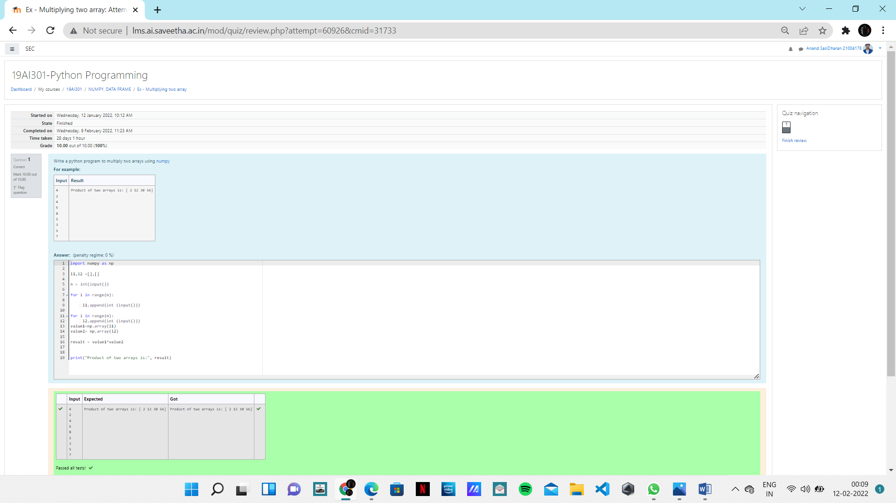

# Multiplying-two-matrix

## AIM:
To multipy two matrices using numpy module.

## ALGORITHM:

### Step 1:
Import numpy as np
### Step 2:
Declare a variable array1 as an empty list. 
### Step 3:
Declare a variable array2 as an empty list.
### Step 4:
Get input value as n 
### Step 5:
Iterate a variable i in range n by for loop and append the values to the list array1
End the loop
## Step 6:
Iterate a vairalbe j in range of n by for loop and append the values to the list array2
End the loop
## Step 7:
Declare a variable prodcut to array and compute array1*array2
## Step 8:
Print the the value of the product

## PROGRAM:
#Developed by: sasi dharan
#Register number: 21004178 
import numpy as np

l1,l2 =[],[]

n = int(input())

for i in range(n):

     l1.append(int (input()))

for i in range(n):
     l2.append(int (input()))
value1=np.array(l1)
value2= np.array(l2)

result = value1*value2

print("Product of two arrays is:", result)

## OUTPUT:

## RESULT:
Hence the numpy module is imported and the programme is succefuuly executed to find the product of two matrices.

